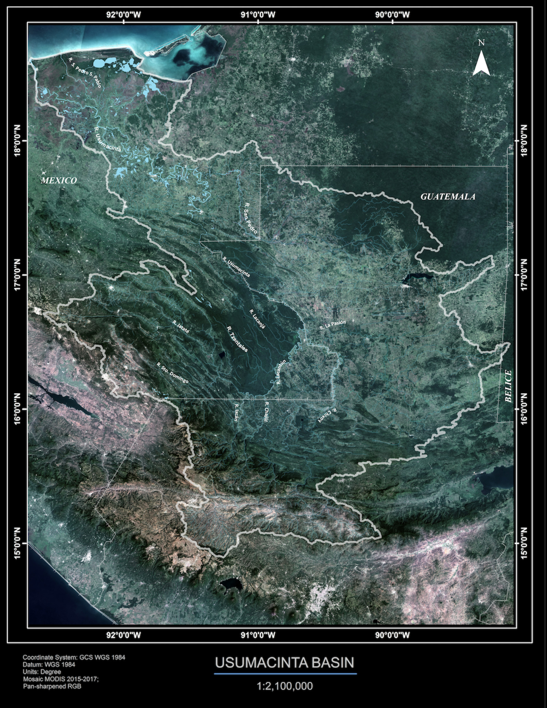
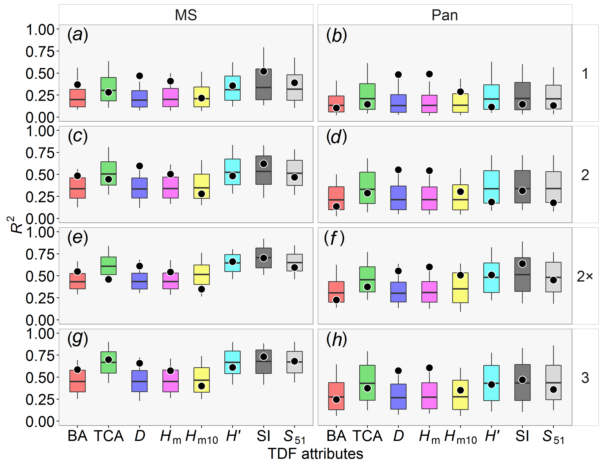
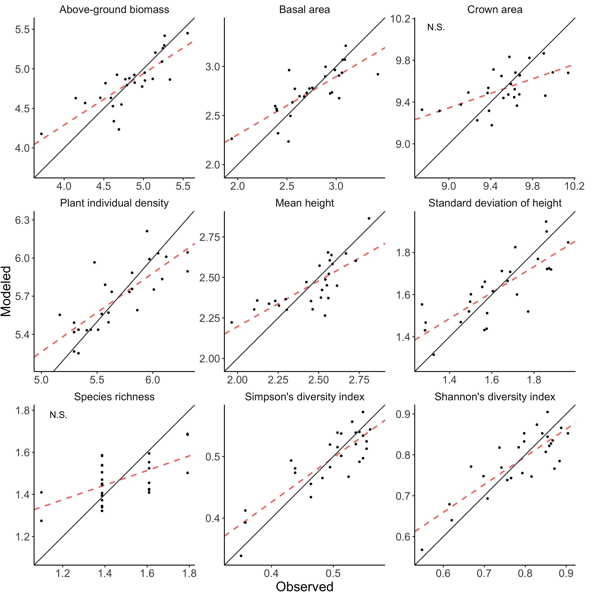
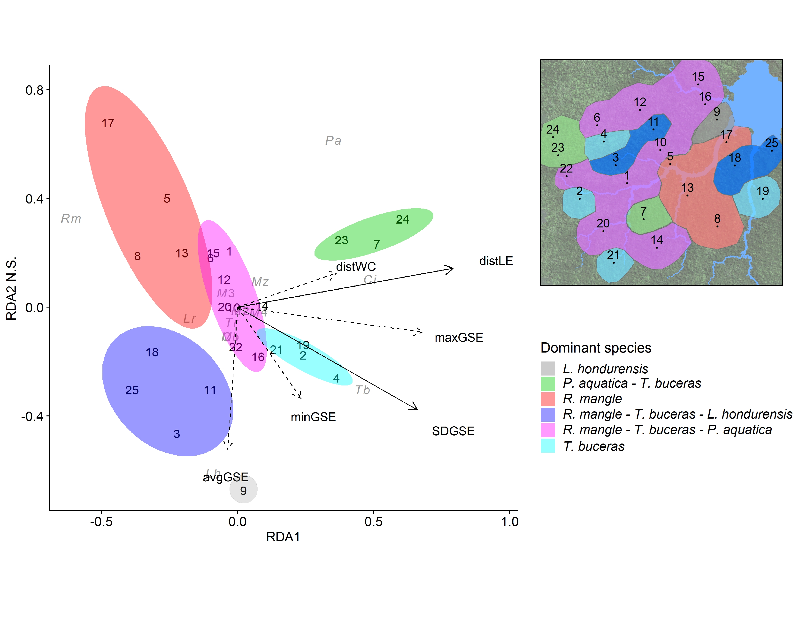
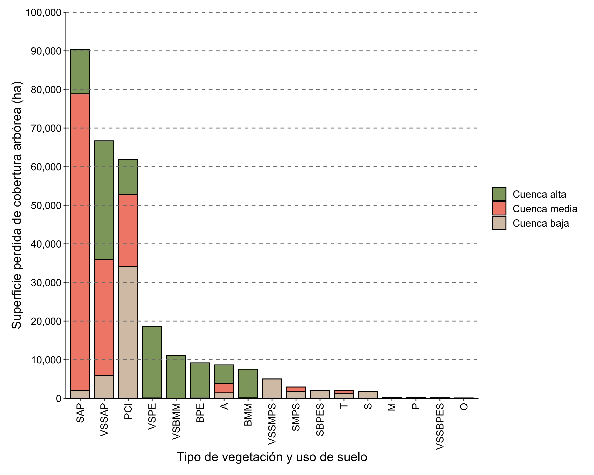
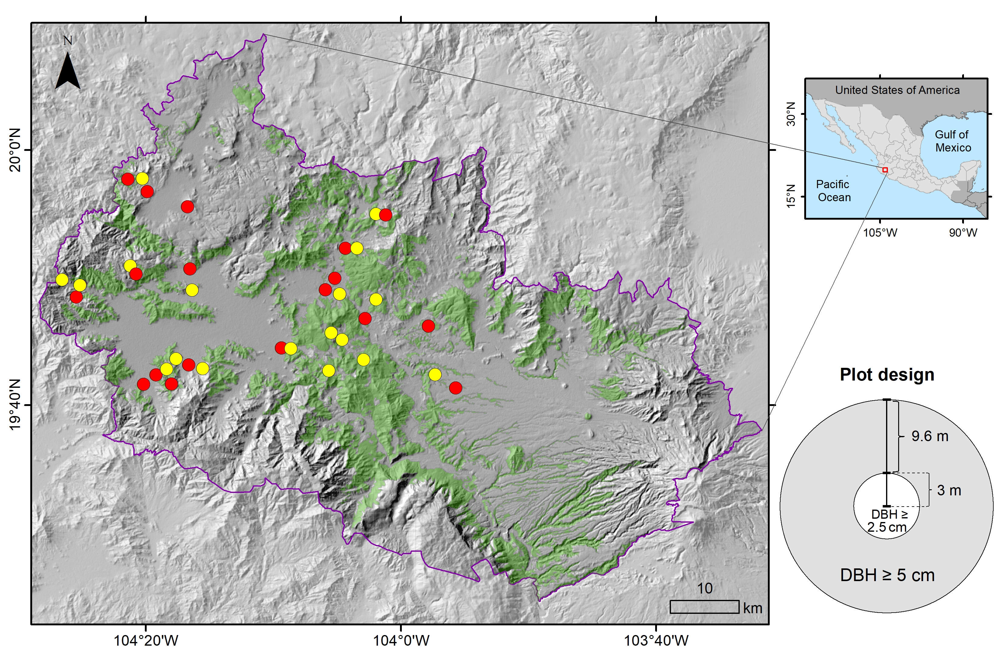

I am a biologist interested in studying tropical forests using remote sensing, mainly multispectral and radar images, as well as LiDAR point clouds. My research includes identifying forest's structure and diversity patterns, evaluating the use of remote sensing information to model these attributes and monitor land cover / land use change. My current PhD project is about using Sentinel-1 and -2 imagery with Deep Learning algorithms to obtain land cover / land use classifications and detect deforested and degradaded areas in tropical forests in Mexico.

I believe that the use of open programming languages such as R or Python, free software such as QGIS and other freely available cloud computing tools such as Google Earth Engine, help in making analyses more transparent and reproducible. Thus, most of my work make use of these tools.

My publications can be consulted in any of the following links:

[**ResearchGate**](https://www.researchgate.net/profile/Jonathan_Solorzano3)  | 
[**Orcid**](https://orcid.org/0000-0001-6422-4802)  |   [**GoogleScholar**](https://scholar.google.com/citations?user=sXi9pZMAAAAJ&hl=en)

I added some figures about my work, that can give a better idea of my research interests.

```{r layout="l-body", fig.cap="Cloudless MODIS composite (2015 - 2017) of the Usumacinta basin and surrounding areas. Figure was made in collaboration with C. Peralta-Carreta and can be seen in the Museo de Historia Natural, CDMX, Mexico."}

```

```{r fig.cap="Goodness-of-fit of the best models (black points) and its corresponding maximum goodness-of-fit distribution expected at random (boxes) for each tropical dry forest attribute (structural and diversity). Models were constructed using GLCM texture metrics calculated from multispectral bands (MS) and panchromatic (Pan) as explanatory variables. Figure from Solórzano et al. (2017)."}

```

```{r fig.cap="Observed versus modeled values and its corresponding linear fit (dashed line) of the best model for each vegetation attribute (ln-transformed) of a Tropical Swamp Forest. Models were fitted using image GLCM texture metric as explanatory variables. Figure from Solórzano et al. (2018)."}

```

```{r fig.cap="RDA ordination showing the scores of the species abundance (gray letters), plots (black numbers) and environmental proxies (black letters) according to the RDA first two principal axes; although, the second axis was not significant. Environmental proxies included distance to water bodies and microtopography variables. Figure from Solórzano et al. (2020)."}

```

```{r fig.cap="Tree cover area lost between 2000 and 2016 according to the Global Forest Change data in the Usumacinta River basin. Data are grouped by land cover / land use (Serie II, INEGI 2001) and part of the basin (low, mid, high). Figure from Peralta-Carreta et al. (2019)."}

```


```{r echo = FALSE, message=FALSE, fig.cap="Number of available Landsat (4-8) images by path (upper border) and row (right border) of Mexico's surface between 1972 - 2017. Additionally, the percentage of images by cloud cover percentage is shown by the bar color. Figure from Solórzano et al. (2020)."}
knitr::include_graphics("images/LandsatMX.jpg")
```

```{r echo = FALSE, message=FALSE, fig.cap="Plots location where conserved and degraded tropical dry forest was sampled in the Ayuquila River basin. Figure from Gao et al. (2020)."}

```

